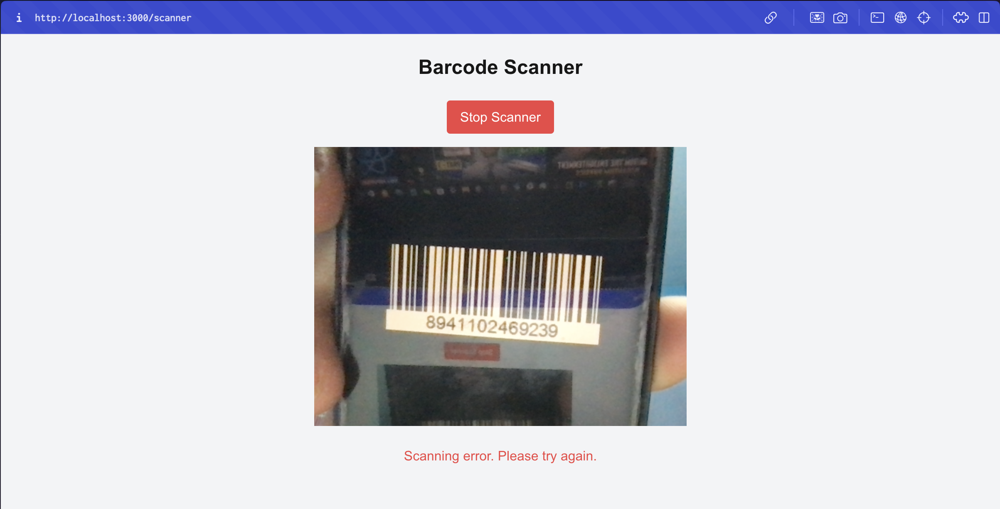
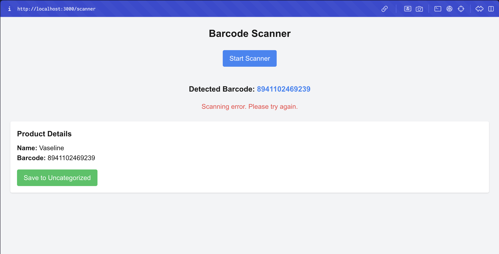
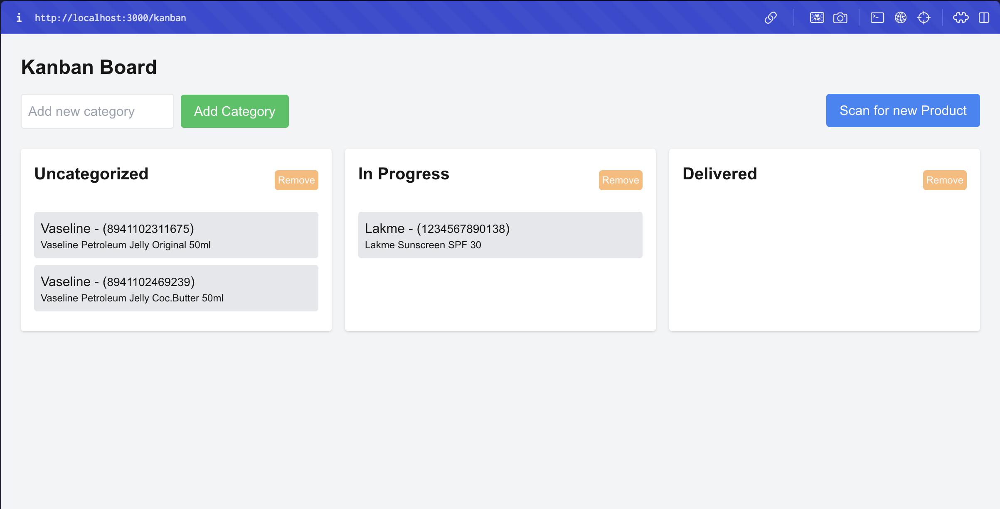

# Barcode-Driven Inventory System with Kanban Board
This project is a fully functional **Barcode-Driven Inventory System** using React (Next.js for the frontend) and Node.js for the backend. The system allows users to scan product barcodes to fetch product details from an external API and manage the inventory through an interactive Kanban board.

- **Frontend**: Developed with React (Next.js), which provides a smooth user interface with features like barcode scanning, drag-and-drop functionality, and a responsive design for both mobile and desktop devices.
- **Backend**: Built with Node.js and MongoDB, it provides APIs for managing products and categories. The system stores the products in MongoDB and supports actions like adding products, fetching products, and updating categories.

## Core Features

### 1. **Barcode Scanning**
- Users can scan product barcodes using a barcode scanning library (e.g., `react-qr-scanner`, `react-barcode-scanner`).
- Once scanned, product details are fetched from an external API: 
  `https://products-test-aci.onrender.com/product/[your_barcode]`.
- The product details are then stored in MongoDB in an 'Uncategorized' category initially.

### 2. **Kanban Board**
- A responsive **Kanban Board** where products are organized into categories.
  - Initially, products are placed in the 'Uncategorized' category.
  - Users can **drag and drop** products between categories.
  - The UI is **fully responsive**, providing an optimal experience across both **mobile** and **desktop** devices.
  - Users can dynamically **add new categories**.

### 3. **API Backend (Node.js)**
- A robust **Node.js** API for managing products and categories. Key features:
  - Add products to the database.
  - Retrieve all products, optionally filtered by category.
  - Update a product's category.
- The backend uses **MongoDB** for data storage and **Mongoose** for easy querying and schema management.

## Tools & Libraries

- **Frontend**:
  - **React / Next.js**: For the frontend development and routing.
  - **Material-UI**: Used for creating a beautiful and responsive Kanban board.
  - **react-beautiful-dnd**: For the smooth drag-and-drop functionality in the Kanban board.
  - **react-qr-scanner** or other barcode scanning libraries for barcode scanning.
  - **TailwindCSS**: For quick and responsive styling of components.

- **Backend**:
  - **Node.js / Express**: Used for building the REST API.
  - **MongoDB**: The database used for storing products and categories.
  - **Mongoose**: For MongoDB schema management and interaction.

- **Authentication**: **JWT-based authentication** for securing API endpoints. With Refresh Tokens for secure API renewal to prevent token theft.

## Project Structure

The project is structured as follows:

```
/server-api                # Node.js server and APIs
  /src                     # Node.js source code
    /app.js                # Application level common logics and configurations
    /controllers           # Controllers for handling API requests
    /serivices             # Service functions for business logic
    /middlewares           # Middleware functions for authentication and error handling
    /models                # Mongoose schemas for Product, Category, User
    /routes                # API routes for managing products and categories
    /types                 # TypeScript types for API requests and responses
    /utils                 # Utility functions for common tasks
    /lib                   # Library functions and utilities such as Token, Bcrypt, etc.
    /config                # Configuration files for environment variables and database connection
    index.ts               # Entry point for the server
  
/client-web                # React/Next.js frontend
  /src                     # React source code
    /app                   # App level routes, components, & layouts (Auth, Kanban, Barcode, etc.)
    /lib                   # Library functions and utilities such as Axios Interceptors
    /hooks                 # Custom React hooks for managing state and API calls
    middleware.ts          # Middleware functions for authentication and error handling
```

## Installation & Setup

### Database Setup
1. **Install Docker**:
   [Install Docker](https://docs.docker.com/get-docker/)

2. **Start MongoDB**: If you have Make insalled, you can use the provided Makefile command:
   ```bash
   make db
   ```
   If you want to start with docker-compose, you can use:
   ```bash
   docker-compose up --build -d mongodb
   ```
   If you don't have Make, you can manually start MongoDB:
   ```bash
   docker run -d -p 27017:27017 --name mongodb mongo
   ```

### Backend Setup

1. **Clone the repository**:
   ```bash
   git clone <repository_url>
   cd server-api
   ```

2. **Install dependencies**:
   ```bash
   npm install
   ```

3. **Configure environment variables**:
   Create a `.env` file with the following variables:
   - `NODE_ENV`: Development environment.
   - `APP_NAME`: Application name.
   - `AUTHOR`: Author name.
   - `MONGO_URI`: [MongoDB connection string - mongodb://localhost:27017/barcode-inventory](mongodb://localhost:27017/barcode-inventory)
   - `PORT`: Server port (default to 8080).
   - `SECRET`: Secret key for JWT.
   - `PRODUCT_FETCH_API`: [External API URL for fetching product data - https://products-test-aci.onrender.com/product](https://products-test-aci.onrender.com/product)

4. **Run the backend server**:
   ```bash
   npm run dev
   ```

   The API server will run on `http://localhost:8080`.

### Frontend Setup

1. **Navigate to the frontend directory**:
   ```bash
   cd client-web
   ```

2. **Install dependencies**:
   ```bash
   npm install --legacy-peer-deps
   ```

3. **Configure environment variables**:
   Create a `.env` file for Next.js and add the following:
   - `NEXT_PUBLIC_API_URL`: [URL of the backend API - http://localhost:8080/api](http://localhost:8080/api)

4. **Run the frontend server**:
   ```bash
   npm run dev
   ```

   The frontend will be available at `http://localhost:3000`.

### Run Full Application with Docker Compose
1. **Navigate to the project root directory**:
   ```bash
   cd barcode-inventory
   ```
2. **Start the application**: If you have Make insalled, you can use the provided Makefile command:
    ```bash
    make all-dev
    ```
    If you want to start with docker-compose, you can use:
    ```bash
    docker-compose up --build -d
    ```

### Running the Full Application

Once both backend and frontend servers are running, you can open the frontend application in your browser and start scanning barcodes to fetch product data, interact with the Kanban board, and perform all the required functionalities.

## Screenshots

### Screenshot 1: [Scanning a Barcode]


### Screenshot 2: [Grabbing Data from API, and Save to Kanban Board]


### Screenshot 3: [Kanban Board with Drag and Drop Functionality, and Category Management]


## Conclusion

This Barcode-Driven Inventory System provides a streamlined experience for managing products via a Kanban board. Users can scan product barcodes, manage them with ease, and dynamically organize them into categories. The system is fully responsive, and includes bonus features such as analytics and authentication.

## License

This project is licensed under the MIT License.